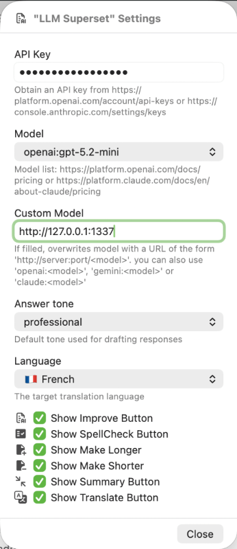

# LLM_Superset.popclipext

  
  

This is my custom LLM extension for PopClip supporting some of the best LLM out there. 

* Supports OpenAI ChatGPT and Anthropic Claude
* Tone settings: professional, concise, and friendly
* Text improvements, corrections, enhancements, and summarization
* Translation into multiple languages
* Holding **SHIFT** copies the response to clipboard
* Easy to modify by editing the code and JavaScript file

## Install

### Option 1

1. Download LLM_Superset.popclipextz
2. Double click the file
3. Follow PopClip instructions

### Option 2

1. Clone the repo  **git clone <this repo url>**
2. Double click on the toplevel folder, LLM_Superset.popclipext
3. Follow PopClip instructions

### Configuration

You need to create API keys with the services to enable the integration. Use the links below to activate them.

* https://platform.openai.com/account/api-keys
* https://console.anthropic.com/settings/keys

## Debug

1. run **defaults write com.pilotmoon.popclip EnableExtensionDebug -bool YES**
2. then open **console.app** and apply filter **Process:PopClip Category:Extension**
