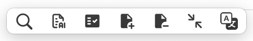
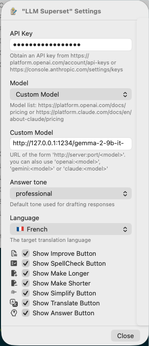

# LLM_Superset.popclipext

Supports
  
  
  

 

 

This is my custom extension for PopClip supporting some of the best LLM.

- Supports OpenAI ChatGPT, Anthropic Claude and Gemini AI
- Tone settings: professional, concise, and friendly
- Text improvements, corrections, enhancements, and summarization
- Translation back and forth into multiple languages
- Holding **SHIFT** copies the response to the clipboard

## Install

### Option 1

1. Download LLM_Superset.popclipextz from the Release section
2. Double click the file
3. Follow PopClip instructions

### Option 2

1. Clone this repo
2. Run command `pnpm i` followed by `pnpm install_ext`
3. The extension will compile into `LLM_Superset.popclipext` and auto-deploy
3. Follow PopClip instructions

### Configuration

You need to create API keys with the LLM service of your choice to enable the integration. Please use one of the links below:

- https://platform.openai.com/account/api-keys
- https://console.anthropic.com/settings/keys
- https://aistudio.google.com/app/api-keys

## Models

A predefined list of models is available from the extension's configuration page. You can however add your own model name by using the `Custom Model` selection and filling the custom url with a special prefix.

- "openai:o3-pro"
- "claude:claude-3-haiku-latest"
- "gemini:gemini-2-flash"

models names can be looked up on these pages:
- https://ai.google.dev/gemini-api/docs/models
- https://platform.openai.com/docs/pricing
- https://platform.claude.com/docs/en/about-claude/pricing

### Using a local LLM

Applications such as [Ollama](https://ollama.com/), [Osaurus](https://osaurus.ai/) or [LLM Studio](https://lmstudio.ai/ allow running models from your local machine.
Local LLM can be integrated by using `Custom Model` in the model selection and filling the matching url.

For instance:

- http://127.0.0.1:1337/federation
- http://127.0.0.1:1337/qwen3-8b-4bit
- http://127.0.0.1:1234/mistral/mistral-7b-4bit

## Star History

## Debug

To help you when creating extensions, PopClip can send script outputs and other debug info to the Console app. To enable it, run this command in Terminal, then Quit and restart PopClip:
`defaults write com.pilotmoon.popclip EnableExtensionDebug -bool YES`

You can then view the debug output in the Console app.

To filter the Console to show just PopClip extensions, enter Process "PopClip" and Category "Extension" in the Search field. You can add this as a saved search by clicking the Save button in the toolbar:

all `print()` commands are sent to the console.