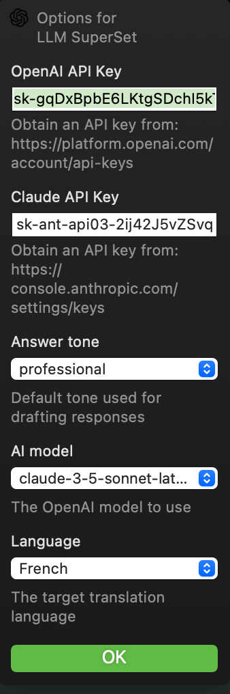

# LLM_Superset.popclipext

Supports
  
  
  

 

 

This is my custom extension for PopClip supporting some of the best LLM.

- Supports OpenAI ChatGPT, Anthropic Claude and Gemini AI
- Tone settings: professional, concise, and friendly
- Text improvements, corrections, enhancements, and summarization
- Translation back and forth into multiple languages
- Holding **SHIFT** copies the response to clipboard

## Install

### Option 1

1. Download LLM_Superset.popclipextz from the Release section
2. Double click the file
3. Follow PopClip instructions

### Option 2

1. Clone this repo
2. Run command `pnpm i` followed by `pnpm install_ext`
3. The extension will compile into `LLM_Superset.popclipext` and auto-deploy
3. Follow PopClip instructions

### Configuration

You need to create API keys with the LLM service of your choice to enable the integration. Please use one of the links below.

- https://platform.openai.com/account/api-keys
- https://console.anthropic.com/settings/keys
- https://aistudio.google.com/app/api-keys

## Star History

## Debug

To enable console debug, follow these instructions

1. from the CLI, run `defaults write com.pilotmoon.popclip EnableExtensionDebug -bool YES`
2. then open OSX's **console.app** and apply filter **Process:PopClip Category:Extension**
